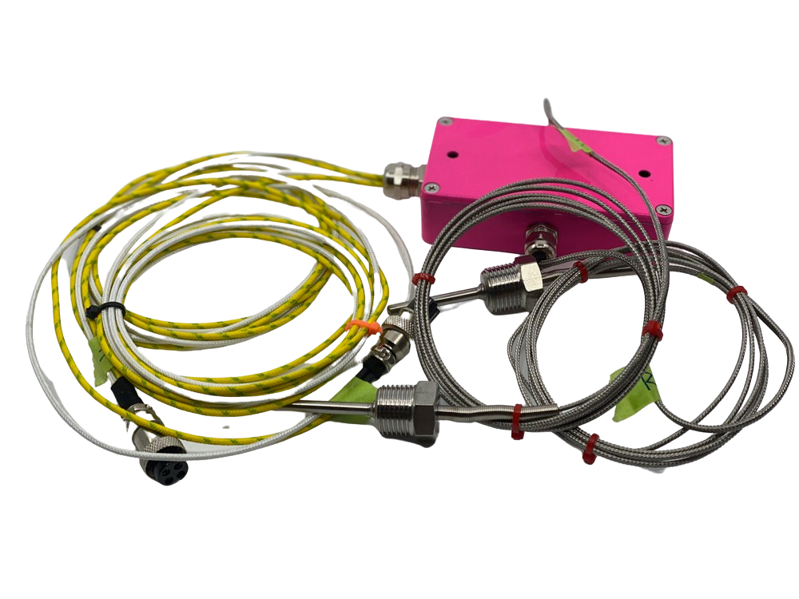

# HARDWARE: External Thermo Coupler Wiring

The BBQ Monitor has two modules that handle the attachment of the Thermocouplers to the main machine.

## The REAR Wiring Module

## The FRONT Wiring Module

