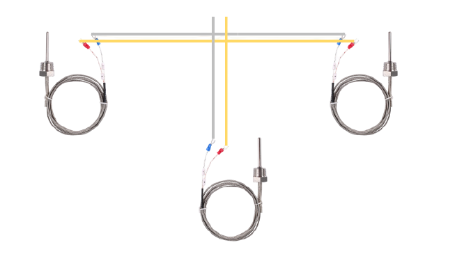
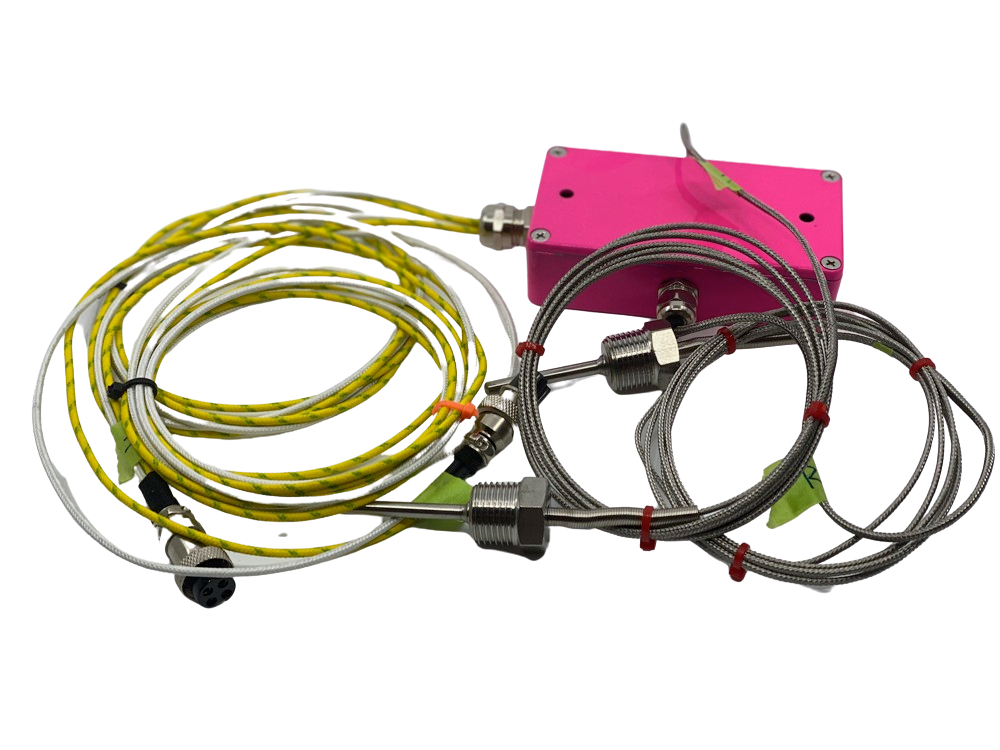

# HARDWARE: External Thermo Coupler Wiring

The BBQ Monitor has two modules that handle the attachment of the Thermocouplers to the main machine.

## The REAR Wiring Module

The is the wiring modile for the rear. It connects the left and right back chamber and the warming box.

## The FRONT Wiring Module

The is the wiring modile for the front. It connects the left and right front chamber.

