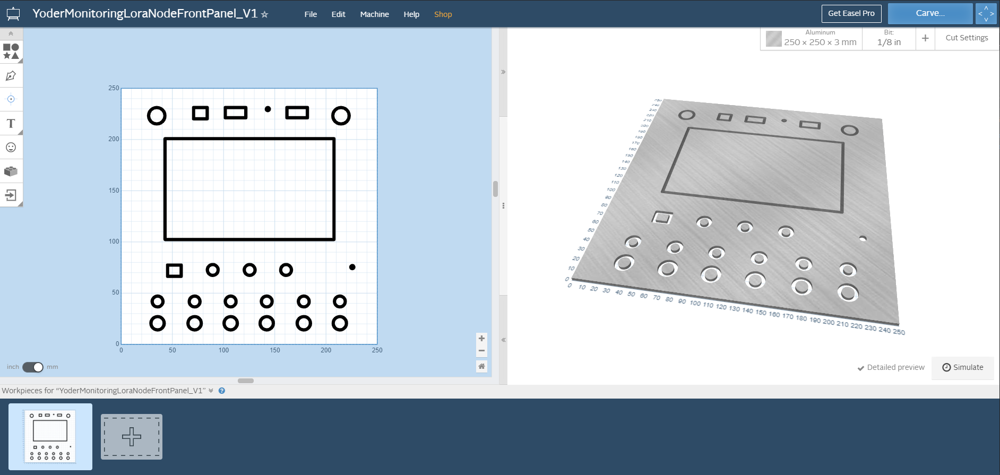

# HARDWARE: X-Carve CNC Carving for the Project Case

The project case is based on the "BUD Industries CN-5713 Die Cast Aluminum Enclosure, 9-27/32" Length x 9-27/32" Width x 4" Height, Natural Finish" and you can view the specs [BUD Industries CN-5713](https://www.budind.com/product/nema-ip-rated-boxes/cn-series-diecast-aluminum-enclosure/cn-5713/)

## The Front Panle:

