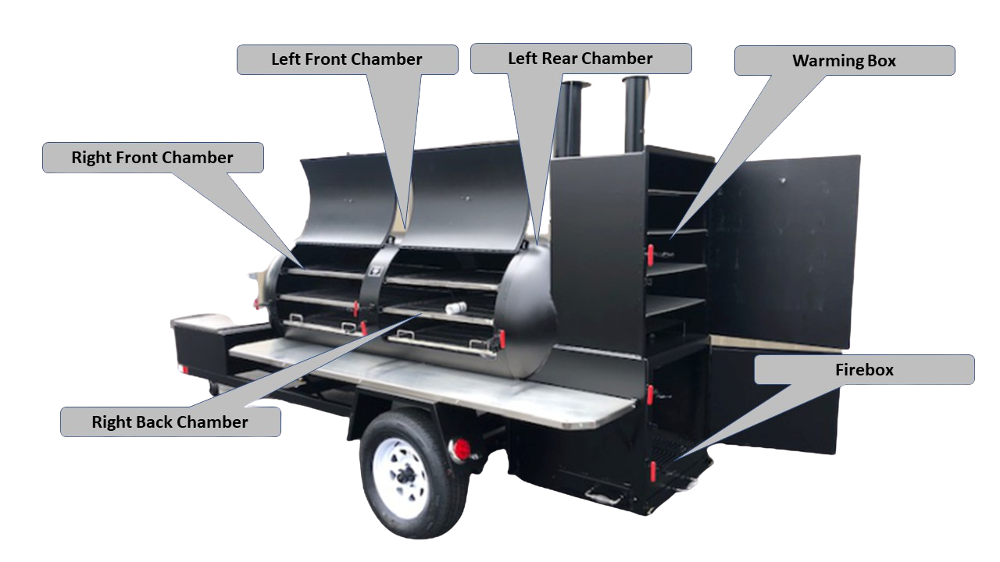

# Saluminator “BBQ Monitor” Internet of Things (IoT) Appliance

## That is a big title! It describes the cool things that the device does.

 Appliance")

Here are the list of features…

- Monitor from 1 to 8 different zones in your BBQ (includes ambient temperature)
- You set the frequency to capture the temperature readings
- Transmit the telemetry to the cloud for visualizations, cook history and analysis
- Set the baseline temperature variance for each zone
- Configure rules and alerts that are triggered by your variance settings
- Load the telemetry from a previous cook to set variances
- Mobile monitoring and notifications
- Alexa integration “Alexa, what are the temperatures at BBQ Monitor #1?”

Let’s talk about the design and details. From here on out, we will refer to our hardware appliance as the <b>“BBQ Monitor”</b>.

## Meet Yoder!

Yoder is a Meadow Creek TS500 Tank Smoker Trailer and he's built out of a 500 gallon tank and can boast of nearly 46 square feet of cooking area. The BBQ Monitor is designed to capture and send the telemetry associated with the six zones of Yoder...

- Fire Box - High heat and the most important zone for variables to maintain consistency through the smoker.
- Warming Box - This box is used to hold items and keep them warm. It is also capable of acting as a smoking box and sports it own chimney.
- The chamber area(s) for front and back are monitored for consistency. You want to maintain steady temperatures for the various lifecycles of the cooking for different meats, etc.

### Features:

- Overall Dimensions: 202"l x 72"w x 98"h
- Grate Dimensions: 2 – 30" x 33", 4 – 34" x 34", Wire
- Grids With ½" Spacing
- Warming Box Grate Dimensions: 21" x 28"
- Metal Thickness on Tank: ¼" Plate
- Metal Thickness on Firebox: ¼" Plate
- Net Weight: 2,800 lbs

### Capacity:

- Capacity of Pork Butts: 64-65
- Capacity of Baby Back Ribs: 50-60
- Capacity of Spare Ribs: 35-40
- Capacity of Whole Briskets: 46-50
- Capacity of Whole Chickens: 100-105
- Capacity of Whole Pigs: 4 x 40 lbs

## BBQ Monitor Design

The BBQ Monitor was designed to be open sourced and shared as a DIY project that most electronic hobbyists and/or software developer can build and make it run. That said, maybe not all of the harder bits like CNC’n the project case, power-coating, soldering and labeling... and if that is help you need, we do offer up pieces you want from a kit that span all the way from the indiviudal boards to a fully completed appliance that we will ship to you. The BBQ Monitor is an advanced piece of kit and you need some software chops in order to bring the whole thing together. We will do our very best to explain things and be accurate in the details.

## HARDWARE

This is an "open hardware" project and you can easily order all of the components online.

We have documented the following for the hardware details...

- Complete bill of materials [BOM](./Docs/BOM.md)
- Overview of the [HARDWARE](./Docs/HARDWARE.md)
- Full wiring diagram (INTERNAL) [WIRING](./Docs/WIRING.md)
- Full wiring diagram (EXTERNAL) [EXTERNAL_WIRING](./Docs/EXTERNAL_WIRING.md)
- All of the additional components and how to connect [ADDITIONAL](./Docs/ADDITIONAL.md)
- CNC plans for the project case (we use Easel for the X-Carve CNC machine) [X-CARVE](./Docs/XCARVE.md)

## SOFTWARE
The device software is written in Python 3 and is fully documented.

- Complete Source Code [PYTHON SRC](./Yoder/tree/master/bbq-monitor)
