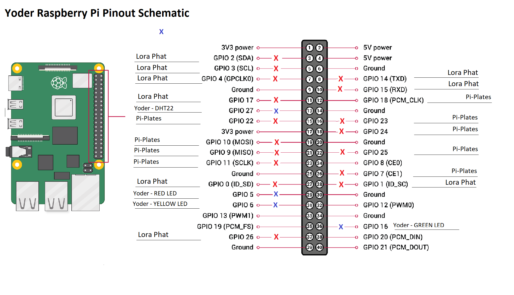
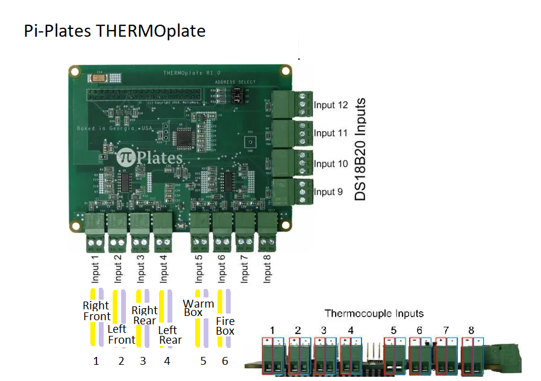
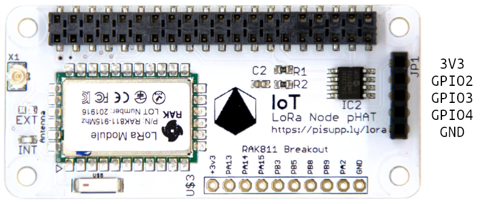

# Yoder
Yoder is an advanced BBQ Management System for Time and Recipe Cooks

Raspberry Pi Pinout Schematic for Yoder:


Pi-Plates THERMOplate Pinout Schematic for Yoder:


Lora Phat for Node: 


```
GPIO
-----------------------------------------------------------------------------------------------------------------------
| 2     4     6     8    10     12    14    16    18    20    22    24    26    28    30    32    34    36    38    40 |
|5V     5V    GND   #    #      o     GND   o     o     GND   o     o     o     #     GND   o     GND   o     o     o  |
|3V3    #     #     #     GND   #     o     o     3V3   o     o     o     GND   #     o     o     o     o     #     GND|
| 1     3     5     7     9     11    13    15    17    19    21    23    25    27    29    31    33    35    37    39 |
-----------------------------------------------------------------------------------------------------------------------
```

# Used
```
o Available

3 SDA1 I2C connected to JP1
5 SCL1 I2C connected to JP1
7 GPIO 4 connected to JP1
8 Tx Connects to Rx on RAK811 module
10 Rx Connects to Tx on RAK811 module
11 GPIO 17 Reset pin
27 ID SD EEPROM
28 ID SC EEPROM
37 ID WP EEPROM

GPS I2C
--------------------------------
| 1     2     3     4     5    |
|VCC    SDA  SCL  GPIO4   GND  |
--------------------------------
This is the same as the first 5 pins from 3v3 to GND on the Raspberry Pi

RAK811 Breakout U$3
---------------------------------------------------------------
| 1     2     3     4     5     6     7     8     9     10    |
|3V3   PA13  PA14  PA15  PB3   PB5   PB8   PB9   PA2   GND    |
---------------------------------------------------------------
```