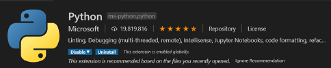
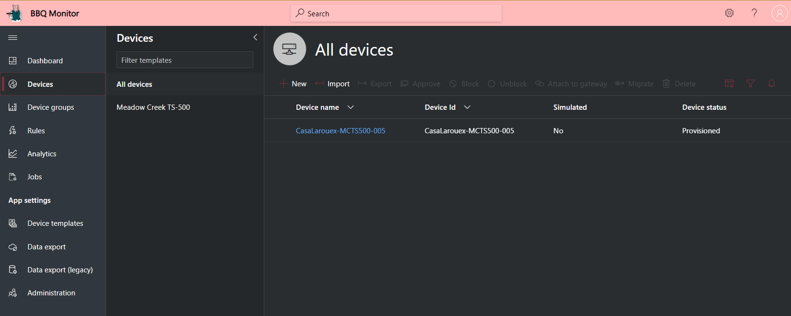

# BBQ Monitor Software Overview

## Setting up Your Development Toolchain
The code in this repository depends on Visual Studio Code and Python.

### Your Local Machine

The development "toolchain" refers to all of the various tools, SDK's and bits we need to install on your machine to facilitate a smooth experience developing our project. Our main development tool will be Visual Studio code. 

This project was developed on Python version 3.8.5 and you should be using the latest version of Python as certain libraries like asyncio may not work in older versions.


| - | Install These Tools |
|---|---|
|  | [LINK: Python 3 Installation Page](https://www.python.org/downloads/) - Python is the programming language we will use to build our applications. |
|  | [LINK: Visual Studio Code Installation Page](https://code.visualstudio.com/download) - Visual Studio Code is a lightweight but powerful source code editor which runs on your desktop and is available for Windows, macOS and Linux. This is the IDE we will use to write code and deploy to the our BLE Devices and the Raspberry Pi Gateway.  |

### Install all the Tools for Visual Studio Code
These are a set of tools we will use to develop our apps. You can open the Extensions sidebar with "Shift+Ctrl+X) or click the icon in the side navigator bar.




### Clone this project "BBQ Monitor Software"...
Find a working folder for this project on your machine...
````bash
git clone https://github.com/LarouexSoftwareDesign/Yoder.git
cd Yoder
cd bbq-monitor
cd src
pip3 install -r requirements.txt
````

Open the "src" folder in Visual Studio Code.


### Install the Azure CLI Tooling
The Azure command-line interface (Azure CLI) is a set of commands used to create and manage Azure resources. The Azure CLI is available across Azure services and is designed to get you working quickly with Azure, with an emphasis on automation.

Click the link below and install on your Desktop environment.

[LINK: Install the Azure CLI Tooling](https://docs.microsoft.com/en-us/cli/azure/install-azure-cli?view=azure-cli-latest)


# Setting up the Development Environment on the Raspberry Pi
We will need to setup our Raspberry Pi with all of the capabilities we will need to develop for our Protcol Translation Gateway.

## Connecting to the Raspberry Pi using SSH
We will be connecting to the Raspberry Pi using the remote SSH capability of Visual Studio Code that we installed as part of our development toolchain. When you set the RPi up, we enabled the device to connect to our Wifi network. 

Now we want to find the IP address of our RPi and connect to via VS Code's Remote SSH tools. This will let us develop our code and test our application working remotely connected to the device.

* Here is the documetnation on the extension for VS Code...
[LINK: Remote Development](https://marketplace.visualstudio.com/items?itemName=ms-vscode-remote.vscode-remote-extensionpack)

* Here is how we will connect to the Raspberry Pi...
[LINK: Remote development over SSH](https://code.visualstudio.com/remote-tutorials/ssh/getting-started)

## Connect to the Raspberry Pi

* Click on the green icon in the bottom left of Visual Studio Code, select "Remote-SSH:Connect to Host..."
* Enter in the connection IP. It will be "pi@your IP Address". For example "pi@192.186.1.174"
* You maybe prompted the first time to indetify the Operationing System, choose "Linux"
* Next, enter the Password for the Raspberry Pi, by default is is raspberry. You should change this right away!
* Open our Home Folder on the Raspberry Pi

   

* Click on left side of the main screen "Open Folder" and the navigation helper will open and default to "/home/pi/" press enter as that is right where we want to go!
  * You maybe prompted re-enter your password (which is no longer raspberry, right?)

## Create our Project Folder on the Raspberry Pi

* Click on "New Folder" icon
* Type in "Projects" and press enter to create the folder

   

## Update Python on the Raspberry Pi

From the terminal, run these two commands to bring your Python environments to the latest versions...

```` python
sudo apt-get install python3
sudo apt-get install python3
````
If it all comes back as up to date, then goodness!

## Creating your IoT Central Application and Configuration

## SECRETS!!! - Azure Connectivity and Protecting Your Secrets
### THIS SECTION IS OPTIONAL AND IS INCLUDED AS A "BEST PRACTICE" FOR HANDLING SECRETS FOR AZURE IOT CENTRAL CONNECTIONS
### The Names and Keys are examples...
<b>NOTE:</b> You can skip this section if you do not plan to use Azure Key Vault to store and retrieve connection secrets. [Click here to jump to the section: I don't want to use Key Vault](#i-dont-want-to-use-key-vault)

Azure IoT Central is used for our telemetry, visualizations and managing devices. It is a powerful SaaS offering and we will be using the tools and visualizations to build out a rich application for our scenario. In order to connect our devices and gateway to IoT Central, we need to manage a set of secrets that we need to protect I highly recommend that you store those secrets in Azure Key Vault and that you do this so as not to make a mistake and expose access to your application, gateway or devices.

I am going to assume the following when we work with Azure and Azure Portal...

* That you already have an Azure Account (If you don't, get started here [LINK: Create your Azure free account today](https://azure.microsoft.com/en-us/free/)
* That you have sufficient permissions in your Azure account to create Resource Groups and associated resources
* That you are familiar creating and using resources with the Azure CLI or the Azure Portal [LINK: Azure Portal](https://portal.azure.com/)

### Create our Connection Secrets...
| Name | Secret (IoT Central Admin [Device Connection] Page)  | Content Type |
|---|---|---|
| larouex-industrial-manufacturing-scopeid | Admin, Device Connection, Copy [ID scope] | Client Secret |
| larouex-industrial-manufacturing-saskey-device-primary | Admin, Device Connection, Devices, View Keys, Copy [Primary Key] | Client Secret |
| larouex-industrial-manufacturing-saskey-device-secondary | Admin, Device Connection, Devices, View Keys, Copy [Secondary Key] | Client Secret |
| larouex-industrial-manufacturing-saskey-gateway-primary | Admin, Device Connection, Azure Edge devices, View Keys, Copy [Primary Key] | Client Secret |
| larouex-industrial-manufacturing-saskey-gateway-secondary | Admin, Device Connection, Azure Edge devices, View Keys, Copy [Secondary Key] | Client Secret |

Once these are all created in Key Vault, your list should look like this...


https://docs.microsoft.com/en-us/azure/key-vault/certificates/quick-create-python

## Get Your Credentials for Azure Login
<b>NOTE:</b> You can skip this section if you do not plan to use Azure Key Vault to Store and Access secrets.

* Open a Terminal or Powershell session
* Login to the Azure CLI...

````bash
az login
````

* If the CLI can open your default browser, it will do so and load an Azure sign-in page.
* Otherwise, open a browser page at https://aka.ms/devicelogin and enter the authorization code displayed in your terminal.
* Sign in with your account credentials in the browser.

````bash
az ad sp create-for-rbac --name http://larouex-industrial-manufacturing --skip-assignment
````

````json
{
  "appId": "<your appID>",
  "displayName": "larouex-industrial-manufacturing",
  "name": "http://larouex-industrial-manufacturing",
  "password": "<your password>",
  "tenant": "<your tenant>"
}
````

````bash
az keyvault set-policy --name <your key vault url> --spn <your password> --secret-permissions get set list delete backup recover restore purge
````

## Configure our Secrets for Local Development
There is a file in the root folder of the project named "secrets_template.json" and this file outlines the shape of Json we use to retrieve secrets. It supports Local Secrets and Key Vault usage. Copy the "secrets_template.json" to a new file named "secrets.json" in the root folder of the project. Open this file in Visual Studio Code and let's start configuring the options.

<b>IMPORTANT: Make sure to check your .gitignore to verify that "secrets.json" is in the list so it does not get checked in! The file should be dithered in your Visual Studio Code Explorer window.</b>


### I want to use the security and awesomeness of Key Vault!
See the Json below the bullets for reference...

* Set "UseKeyVault" to true
* From the Azure Portal, Goto your Key Vault Resource
* Goto Secrets
* Click onto your secret for Scope ID that we set up previously
* Click the copy button next to the "Secret Identifier"
* Paste it into the "KeyVaultUri" in the "secrets.json" file.
* Highlight and cut the remainder of url after .../secrets/
* Paste into the ScopeId field
* Repeat for all the secrets we setup previously and put into the right fields!

<b>Your file should look like this when completed...</b>

```` json
{
  "UseKeyVault": true,
  "ProvisioningHost": "global.azure-devices-provisioning.net",
  "LocalSecrets": {
    "ScopeId": "",
    "DeviceConnect":{
      "SaSKeys":{
          "Primary": "",
          "Secondary": ""
      }
    },
    "GatewayConnect":{
      "SaSKeys":{
          "Primary": "",
          "Secondary": ""
      }
    }
  },
  "KeyVaultSecrets":{
    "KeyVaultUri": "<Your Key Vault UIR>",
    "TenantId":"<Your Tenant ID>",
    "ClientId":"<Your Client ID>",
    "ClientSecret":"<Your Client Secret>",
    "ScopeId": "larouex-industrial-manufacturing-scopeid",
    "DeviceConnect":{
      "SaSKeys":{
          "Primary": "larouex-industrial-manufacturing-saskey-device-primary",
          "Secondary": "larouex-industrial-manufacturing-saskey-device-secondary"
      }
    },
    "GatewayConnect":{
      "SaSKeys":{
          "Primary": "larouex-industrial-manufacturing-saskey-gateway-primary",
          "Secondary": "larouex-industrial-manufacturing-saskey-gateway-secondary"
      }
    }
  }
}
````
Save the file and you can ignore the "LocalSecrets" section.

### I don't want to use Key Vault!
If you are working locally and do not want to implement the security and awesomeness of Key Vault, then go ahead and set "UseKeyVault" to false and fill out the section "LocalSecrets" with all our your SaS key values from the Admin, Device Connection page in IoT Central...

````json
{
  "UseKeyVault": false,
  "ProvisioningHost": "global.azure-devices-provisioning.net",
  "LocalSecrets": {
    "ScopeId": "<Your Scope ID from IoT Central Device Connect Page>",
    "DeviceConnect":{
      "SaSKeys":{
          "Primary": "<Your Primary Key from IoT Central Device Connect Page>",
          "Secondary": "<Your Secondary Key from IoT Central Device Connect Page>"
      }
    },
    "GatewayConnect":{
      "SaSKeys":{
          "Primary": "<Your Gateway Primary Key from IoT Central Device Connect Page>",
          "Secondary": "<Your Gateway Secondary Key from IoT Central Device Connect Page>"
      }
    }
  },
  "KeyVaultSecrets":{
    "KeyVaultUri": "",
    "TenantId":"",
    "ClientId":"",
    "ClientSecret":"",
    "ScopeId": "",
    "DeviceConnect":{
      "SaSKeys":{
          "Primary": "",
          "Secondary": ""
      }
    },
    "GatewayConnect":{
      "SaSKeys":{
          "Primary": "",
          "Secondary": ""
      }
    }
  }
}
````
Save the file and you can ignore the "KeyVaultSecrets" section.

## Provisioning our BBQ Monitor as a Device in Azure IoT Central
Provisioning is factored into a "stand-alone" operation.

There are excellent tutorials on connecting devices to IoT Central and using Device Provisioning Services online and we won't try to repeat that here. If you are not familiar, take a break and visit these topics...

* [LINK: Get connected to Azure IoT Central](https://docs.microsoft.com/en-us/azure/iot-central/core/concepts-get-connected)
* [LINK: Tutorial: Create and connect a client application to your Azure IoT Central application (Python)](https://docs.microsoft.com/en-us/azure/iot-central/core/tutorial-connect-device-python)

Provisioning in our Gateway project is one of key pillars of capabilities we have created and we have lots of options so you can try the various Gateway scenarios. Let's look at all the options by running with --help...

````bash
python3 ./provisiondevices.py -h
````

<b>Output</b>
````bash
  HELP for provisiondevices.py
  -----------------------------------------------------------------------------------------------------------------
  BASIC PARAMETERS...

  -h or --help - Print out this Help Information
  -v or --verbose - Debug Mode with lots of Data will be Output to Assist with Debugging
  -d or --debug - Debug Mode with lots of DEBUG Data will be Output to Assist with Tracing and Debugging

  OPTIONAL PARAMETERS...

    -r or --registerid - This numeric value will get appended to your provisioned device. Example '1' would result in larouex-smart-kitchen-1
       USAGE: -r 5
       DEFAULT: 1

    -i or --infilename - Name of the configuration file to process for generation of the DTDL mapping.
       USAGE: -i config_smartkitchen.json
       DEFAULT: config.json

    -m or --modeltype - Provision as collective Twins, Gateways or by Devices Pattern.
       USAGE: -m Twins | -m Gateways | -m Devices
       DEFAULT: Twins

    -n or --numberofdevices - The value is used to enumerate and provision the device(s) count specified.
       USAGE: -n 10
       DEFAULT: 1
------------------------------------------------------------------------------------------------------------------
````

Let's actually provision our Device now...

````bash
python3 .\provisiondevices.py -v -m Twins -n 1 -r 005
````

Output...
````bash
...
INFO: Verbose Logging Mode...
INFO: Model Type is Specified as: Twins
INFO: Number of Devices is Specified as: 1
INFO: Register Id is Specified as: 005
INFO: [USING LOCAL SECRETS]
********************************
DEVICES TO PROVISION: 
{
	'Devices': {
		'Devices': [{
			'Name': 'CasaLarouex-MCTS500-005',
			'DeviceType': 'Twins',
			'DeviceCapabilityModelId': 'urn:BBQMonitor:MeadowCreekTS500:1',
			'Interfaces': [{
				'Name': 'MonitorCookSixZones',
				'InterfacelId': 'urn:BBQMonitor:MonitorCookSixZones:1',
				'InterfaceInstanceName': 'MonitorCookSixZonesInstance'
			}],
			'LastProvisioned': '2020-10-20 07:55:39.450043'
		}]
	},
	'Secrets': [{
		'Name': 'CasaLarouex-MCTS500-005',
		'DeviceCapabilityModelId': 'urn:BBQMonitor:MeadowCreekTS500:1',
		'DeviceType': 'Twins',
		'AssignedHub': '',
		'DeviceSymmetricKey': '-- hidden --',
		'LastProvisioned': '2020-10-20 07:55:39.450043'
	}]
}
********************************
INFO: creating mqtt client
INFO: Creating client for connecting using MQTT over websockets
INFO: Registering with Provisioning Service...
INFO: Enabling reception of response from Device Provisioning Service...
INFO: ReconnectStage(ConnectOperation): State changes LOGICALLY_DISCONNECTED->LOGICALLY_CONNECTED.  Adding to wait list and sending new connect op down
INFO: MQTTTransportStage(ConnectOperation): connecting
INFO: connecting to mqtt broker
INFO: Connect using port 443 (websockets)
INFO: connected with result code: 0
INFO: _on_mqtt_connected called
INFO: ConnectionLockStage(ConnectOperation): processing 0 items in queue
INFO: ReconnectStage: completing waiting ops with error=None
INFO: AutoConnectStage(MQTTSubscribeOperation): Connected.  Sending down and adding callback to check result
INFO: MQTTTransportStage(MQTTSubscribeOperation): subscribing to $dps/registrations/res/#
INFO: subscribing to $dps/registrations/res/# with qos 1
INFO: suback received for 1
INFO: Successfully subscribed to Device Provisioning Service to receive responses
INFO: AutoConnectStage(MQTTPublishOperation): Connected.  Sending down and adding callback to check result
INFO: MQTTTransportStage(MQTTPublishOperation): publishing on $dps/registrations/PUT/iotdps-register/?$rid=1320aef6-3a89-4b15-9487-881e36944677
INFO: publishing on $dps/registrations/PUT/iotdps-register/?$rid=1320aef6-3a89-4b15-9487-881e36944677
INFO: payload published for 2
INFO: message received on $dps/registrations/res/202/?$rid=1320aef6-3a89-4b15-9487-881e36944677&retry-after=3
INFO: Received payload:b'{"operationId":"4.3bebef837565cc70.084d383f-ec7b-4820-86a4-d6a4be08689c","status":"assigning"}' on topic:$dps/registrations/res/202/?$rid=1320aef6-3a89-4b15-9487-881e36944677&retry-after=3
WARNING: RegistrationStage(RequestAndResponseOperation): Op will transition into polling after interval 2.  Setting timer.
INFO: RegistrationStage(RequestAndResponseOperation): polling
INFO: AutoConnectStage(MQTTPublishOperation): Connected.  Sending down and adding callback to check result
INFO: MQTTTransportStage(MQTTPublishOperation): publishing on $dps/registrations/GET/iotdps-get-operationstatus/?$rid=c944f3e9-3bd6-47f2-8522-637120954296&operationId=4.3bebef837565cc70.084d383f-ec7b-4820-86a4-d6a4be08689c
INFO: publishing on $dps/registrations/GET/iotdps-get-operationstatus/?$rid=c944f3e9-3bd6-47f2-8522-637120954296&operationId=4.3bebef837565cc70.084d383f-ec7b-4820-86a4-d6a4be08689c
INFO: payload published for 3
INFO: message received on $dps/registrations/res/200/?$rid=c944f3e9-3bd6-47f2-8522-637120954296
INFO: Received payload:b'{"operationId":"4.3bebef837565cc70.084d383f-ec7b-4820-86a4-d6a4be08689c","status":"assigned","registrationState":{"registrationId":"CasaLarouex-MCTS500-005","createdDateTimeUtc":"2020-10-20T14:55:40.0481628Z","assignedHub":"iotc-783e1626-dc01-4884-ab90-de9e1f736088.azure-devices.net","deviceId":"CasaLarouex-MCTS500-005","status":"assigned","substatus":"initialAssignment","lastUpdatedDateTimeUtc":"2020-10-20T14:55:40.2739316Z","etag":"ImEwMDAzOGU2LTAwMDAtMDcwMC0wMDAwLTVmOGVmYTZjMDAwMCI="}}' on topic:$dps/registrations/res/200/?$rid=c944f3e9-3bd6-47f2-8522-637120954296
INFO: Successfully registered with Provisioning Service
INFO: [REGISTRATION RESULT] CasaLarouex-MCTS500-005
iotc-783e1626-dc01-4884-ab90-de9e1f736088.azure-devices.net
initialAssignment
assigned
********************************
INFO: Updated Secrets file
````

This is the data that will be written to our "devicescache.json" for the device information reflecting our BBQ Monitor...

````json
  {
    "Devices": [
      {
        "Name": "CasaLarouex-MCTS500-005",
        "DeviceType": "Twins",
        "DeviceCapabilityModelId": "urn:BBQMonitor:MeadowCreekTS500:1",
        "Interfaces": [
          {
            "Name": "MonitorCookSixZones",
            "InterfacelId": "urn:BBQMonitor:MonitorCookSixZones:1",
            "InterfaceInstanceName": "MonitorCookSixZonesInstance"
          }
        ],
        "LastProvisioned": "2020-10-14 11:08:29.922573"
      }
    ]
  }
````

This is the secret data that will be written to our "secrets.json" for the device connectivity reflecting our BBQ Monitor details to connect to Azure IoT Central...

````json
  "Devices": [
    {
      "Name": "CasaLarouex-MCTS500-005",
      "DeviceCapabilityModelId": "urn:BBQMonitor:MeadowCreekTS500:1",
      "DeviceType": "Twins",
      "AssignedHub": "-- hidden assigned-hub --",
      "DeviceSymmetricKey": "-- hidden device-symmetric-key --",
      "LastProvisioned": "2020-10-20 07:55:39.450043"
    }
  ]
````

## The BBQ Monitor Device is Provisioned!



